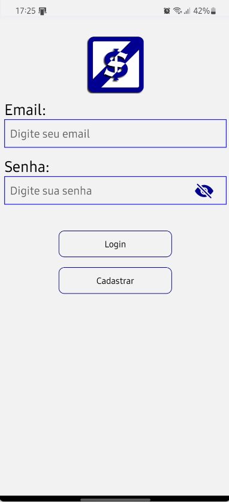

# AuthScreen

Este componente React-Native, chamado de `AuthScreen`, representa a tela de autenticação do aplicativo.  
Oferece funcionalidades de login e cadastro, interagindo com um banco de dados Firebase para gerenciar usuários.

## Funcionalidades Principais

1. **Autenticação e Navegação:**
   - Utiliza o contexto `useLoading` para exibir indicadores de carregamento durante operações assíncronas.
   - Utiliza o `AsyncStorage` para persistir a informação de autenticação (`isAuth`).

2. **Gerenciamento de Usuários:**
   - Utiliza a classe `Storage` para interagir com o Firebase e obter informações sobre usuários.
   - Ao montar o componente, verifica se o usuário já está autenticado, redirecionando-o para a tela inicial (`Splash`) se necessário.

3. **Estados e Campos de Entrada:**
   - Utiliza estados para controlar diferentes aspectos do componente, incluindo informações de usuários, mensagens de erro, visibilidade de senha, entre outros.
   - Campos de entrada controlados por estados para email e senhas.

4. **Manipulação de Senhas:**
   - Oferece funcionalidade para alternar a visibilidade da senha durante a entrada de texto, utilizando ícones visuais (`eye`).

5. **Login e Cadastro:**
   - Função `handleSignUp` para cadastrar novos usuários no Firebase, verificando se o email já existe.
   - Função `handleSignIn` para autenticar usuários, exibindo mensagens de erro caso o email ou senha não sejam válidos.

6. **Limpeza de Campos:**
   - Função `clearFields` para limpar os campos do formulário, utilizada após operações de login ou cadastro.

7. **Feedback ao Usuário:**
   - Exibe mensagens de erro em caso de problemas durante o login ou cadastro.
   - Oferece link para recuperação de senha em caso de erro no login.

8. **Estilo e Layout:**
   - Utiliza estilos específicos para proporcionar uma experiência visual agradável ao usuário.

## Componentes Utilizados

- `React`, `useState`, `useEffect` para gerenciar o estado e o ciclo de vida.
- Componentes de interface como `View`, `Text`, `TextInput`, `Button`, `TouchableOpacity`, `Image`.
- Ícones fornecidos pelos pacotes `@expo/vector-icons` (Foundation, Ionicons).

## Observações

- O componente pode ser integrado a um fluxo de autenticação mais amplo em um aplicativo, proporcionando funcionalidades essenciais de login e cadastro.

Lembre-se de ajustar qualquer configuração específica do seu projeto, como a configuração do Firebase, para que o componente funcione corretamente no contexto do seu aplicativo.

