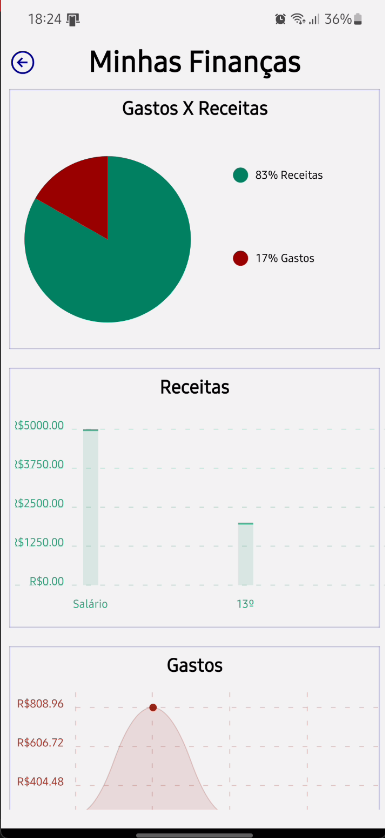

# Graphs

O componente React-Native denominado `Graphs` é responsável por exibir gráficos relacionados às finanças do usuário, incluindo um gráfico de receitas e gastos, um gráfico de barras para receitas e um gráfico de linha para gastos.

## Principais Características

1. **Gastos X Receitas:**
   - Utiliza um gráfico de pizza (`PieChart`) para visualizar a relação entre gastos e receitas.
   - Cada categoria é representada por uma fatia no gráfico.
   - Cores diferenciadas para representar gastos e receitas.

2. **Gráfico de Receitas:**
   - Apresenta um gráfico de barras (`BarChart`) para visualizar as receitas.
   - As barras representam diferentes fontes de receita.
   - Eixo Y rotulado em Reais (R$).

3. **Gráfico de Gastos:**
   - Mostra um gráfico de linha (`LineChart`) para visualizar os gastos ao longo do tempo.
   - Cada ponto no gráfico representa um tipo de despesa.
   - Toque em um ponto para exibir um alerta com detalhes sobre a despesa.

4. **Integração com FlashMessage:**
   - Utiliza o componente `FlashMessage` para exibir mensagens temporárias ao clicar em um ponto no gráfico de gastos.

5. **Navegação de Volta:**
   - Inclui um botão de navegação que permite voltar à página inicial.

## Parâmetros

- O componente não aceita parâmetros externos. Ele extrai dados diretamente da rota (`route.params.allData`).

**Configurações de Gráficos:**
- Configurações específicas para cada tipo de gráfico, como cores e estilos, são definidas para proporcionar uma experiência visual agradável.

**Estilos Padrão:**
- Os estilos são definidos para garantir a coesão visual dos gráficos e a legibilidade das informações.

## Observações

- O componente faz uso da Context API para exibição de loading durante a recuperação de dados.
- As bibliotecas externas `react-native-chart-kit` e `react-native-flash-message` são utilizadas para renderizar os gráficos e exibir mensagens temporárias, respectivamente.

**Referências de Ícones:**
- `Ionicons`: Ícone de seta para voltar à página inicial.

 

