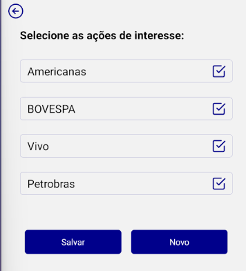

# InvestmentsCheckbox

## Funcionalidades Principais

A tela de Seleção de Ações de Interesse permite ao usuário visualizar e modificar suas escolhas de investimentos. As funcionalidades incluem:

### Principais Funcionalidades:

1. **Visualização e Seleção de Ações:**
   - Exibe a lista de ações de interesse do usuário.
   - Permite ao usuário selecionar/deselecionar ações de interesse.

2. **Atualização Automática:**
   - Atualiza automaticamente a lista de ações conforme o usuário realiza seleções.

3. **Salvar Alterações:**
   - Possui um botão "Salvar" que, ao ser acionado, salva as alterações realizadas nas seleções de ações.

4. **Adicionar Nova Ação:**
   - Oferece um botão "Novo" para direcionar o usuário à página de cadastro de novas ações de interesse.

## Componentes Utilizados

A tela utiliza diversos componentes do React Native para proporcionar uma experiência amigável ao usuário. Alguns dos principais componentes incluem:

1. **FlatList:**
   - Utilizada para renderizar a lista de ações de interesse de forma eficiente.

2. **TouchableOpacity:**
   - Componente que possibilita a criação de botões clicáveis.

3. **CheckBox Component:**
   - Componente customizado para representar visualmente a seleção/deseleção de ações.

## Pré-requisitos

Para utilizar a tela de Seleção de Ações de Interesse, é necessário garantir que o aplicativo tenha acesso à API do Firebase Firestore para recuperar e armazenar dados do usuário. Além disso, o AsyncStorage deve estar configurado para armazenar informações localmente.

## Observações

1. **Interatividade Simples:**
   - A tela é projetada para ser simples e intuitiva, permitindo ao usuário realizar suas escolhas de investimentos de forma rápida.

2. **Feedback Visual:**
   - Utiliza uma representação visual (checkBox) para indicar as ações de interesse selecionadas.

3. **Botão "Novo":**
   - Oferece um atalho para a página de cadastro de novas ações, facilitando a expansão da lista de investimentos.

4. **Atualização Automática:**
   - As alterações realizadas na seleção de ações são salvas automaticamente ao pressionar o botão "Salvar".

5. **Estilo Visual:**
   - Utiliza estilos visuais para proporcionar uma experiência agradável e coerente com o restante do aplicativo.

