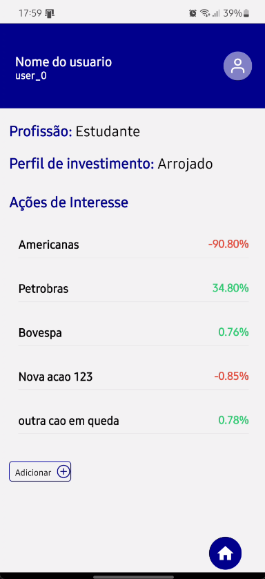

# Profile

O componente React-Native denominado `Perfil` é projetado para exibir informações do usuário, incluindo detalhes pessoais, dados financeiros e lista de investimentos.  Fornece uma interface de usuário limpa e interativa para visualizar e interagir com informações relevantes.

## Principais Características

1. **Barra Superior:**
   - A barra superior possui uma cor de fundo escura (`darkBlue`) e exibe o nome do usuário e o ícone de perfil.

2. **Informações do Usuário:**
   - Exibe o nome e e-mail do usuário, proporcionando uma experiência personalizada.
   - Permite a interação para a alteração da foto de perfil.

3. **Detalhes Financeiros:**
   - Apresenta a profissão e o perfil de investimento do usuário.
   - Lista os investimentos atuais do usuário com detalhes sobre as ações de interesse.

4. **Lista de Investimentos:**
   - Utiliza o componente `FlatList` para renderizar a lista de investimentos.
   - Exibe o rótulo do investimento, status (ativo ou inativo) e a porcentagem associada.

5. **Adicionar Investimento:**
   - Oferece um botão para adicionar novos investimentos, redirecionando para a página "Investments".

6. **Botão de Navegação para a Página Inicial:**
   - Inclui um botão de navegação que direciona o usuário de volta à página inicial.

## Parâmetros
- Este componente não aceita parâmetros externos. Ele obtém as informações do usuário e investimentos diretamente do banco de dados Firebase.

**Estilo Padrão:**
- Utiliza estilos específicos para garantir uma aparência coesa e agradável ao usuário.
- Adapta-se a diferentes tamanhos de tela.

## Observações

- Este componente faz uso da Context API para exibição de loading durante a recuperação de dados do banco de dados Firebase.
- O botão de adição de investimento possui uma animação de entrada.

## Exemplo de Uso

```jsx
<Perfil navigation={navigation} />
```

**Referências de Ícones:**
- `Feather`: Ícone de usuário para a alteração de foto de perfil.
- `MaterialIcons`: Ícone de casa para o botão de navegação de volta à página inicial.
- `AntDesign`: Ícone de adição para adicionar novos investimentos.



