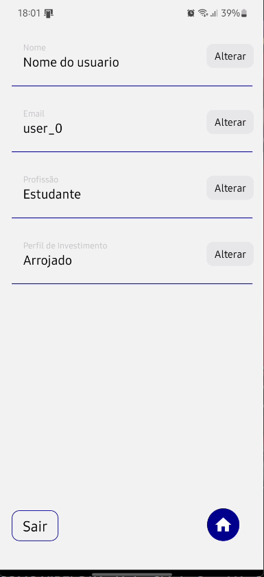

# Settings

A tela `Settings` é responsável por exibir e permitir a edição de informações do usuário, como nome, email, profissão e perfil de investimento.  
Além disso, fornece um botão para retornar à tela inicial (`Home`) e outro para realizar o logout (`Sair`).

## Principais Características

1. **Exibição e Edição de Dados:**
   - Utiliza o componente `ChangeData` para exibir e permitir a edição de diferentes campos de dados do usuário, como nome, email, profissão e perfil de investimento.
   - Ao editar um campo, aciona uma função `refresh` para atualizar as informações na tela.

2. **Botão de Retorno à Tela Inicial:**
   - Inclui um botão de retorno à tela inicial (Home) para facilitar a navegação.
   - O botão utiliza o ícone de casa da biblioteca `MaterialIcons`.

3. **Botão de Logout (`Sair`):**
   - Inclui um botão para realizar o logout do usuário.
   - Ao clicar no botão, aciona a função `handleSair` que remove a autenticação e navega para a tela de autenticação (`Auth`).

4. **Atualização Dinâmica dos Dados:**
   - Utiliza o estado `smth` para acionar uma atualização dinâmica dos dados quando necessário.

5. **Estilo Responsivo:**
   - Utiliza estilos que proporcionam uma boa aparência e organização na tela.
   - Adota margens, espaçamentos e posicionamento absoluto para melhorar a legibilidade e usabilidade.

## Exemplo de Uso

```jsx
<Settings />
```

## Observações

- A tela utiliza o contexto de carregamento (`useLoading`) para exibir e ocultar indicadores de carregamento durante a obtenção dos dados.
- As informações do usuário são obtidas do Firebase (`fr.getFullDoc()`).
- A função `refresh` é utilizada para acionar a atualização dos dados após uma edição.
- O botão "Sair" (`handleSair`) realiza o logout do usuário e navega para a tela de autenticação (`Auth`).
- A tela inclui um botão de retorno à tela inicial (`Home`) para facilitar a navegação.


